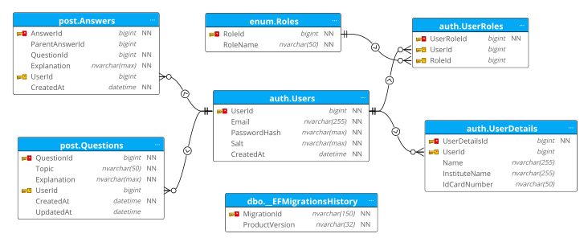
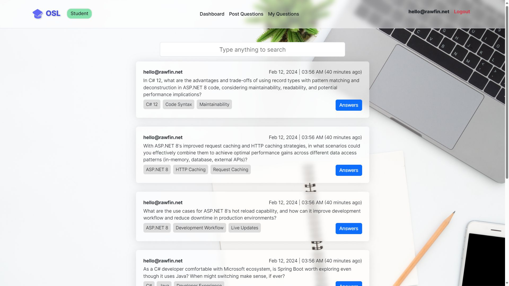
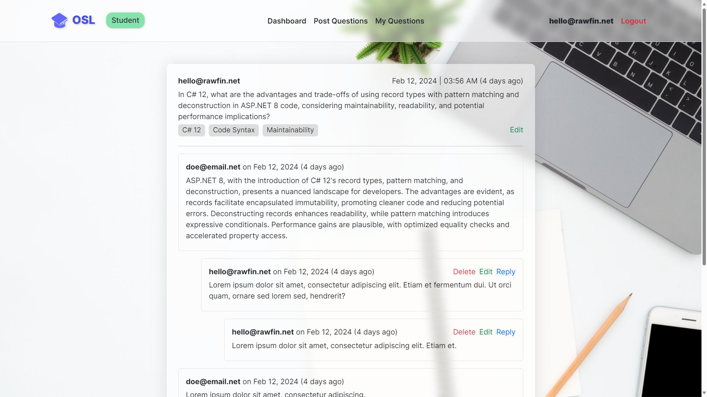
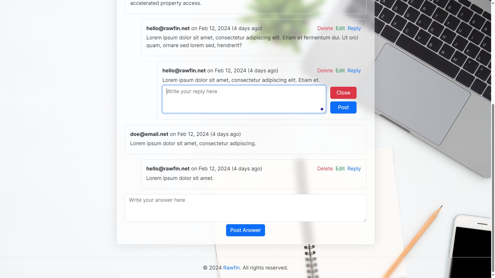
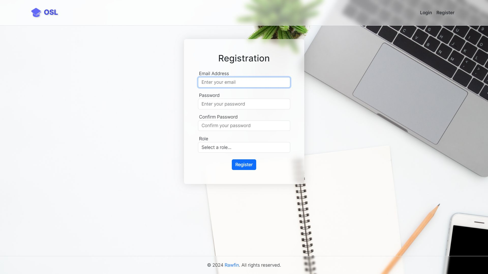
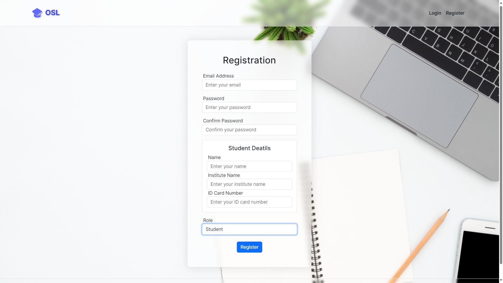
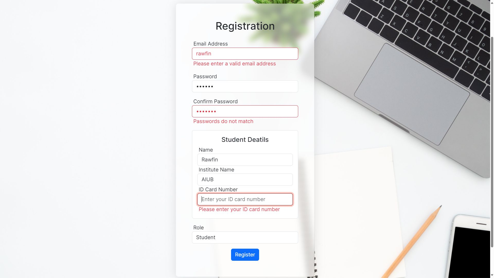

# OSI: Student - Teacher Question & Answer Platform

A compact web application focused on study-related communication between students and teachers.

## Database Migration Command

Package Manager Console:

```powershell
Update-Database -Context OslDbContext -Project OSL.DAL
```

.NET CLI:

```powershell
dotnet ef database update --context OslDbContext --project OSL.DAL
```

## User Credentials

| Role      | Email            | Password |
| --------- | ---------------- | -------- |
| Student   | hello@rawfin.net | 1111     |
| Teacher   | doe@email.net    | 1111     |
| Moderator | bob@email.net    | 1111     |

## Schema Diagram

<p align= "center">
  
</p>

## Folder Structure

```console
 src
  ├───OSL.BLL
  │   │   OSL.BLL.csproj
  │   │ 
  │   ├───Enums
  │   ├───Interfaces
  │   ├───Models
  │   ├───Services
  │   │ 
  ├───OSL.DAL
  │   │   OSL.DAL.csproj
  │   │ 
  │   ├───Entities
  │   ├───Interfaces
  │   ├───Migrations
  │   ├───Models
  │   ├───Repositories
  │   │ 
  └───OSL.WEB
      │   OSL.WEB.csproj
      │   Program.cs
      │   appsettings.json
      │   
      ├───Attributes
      ├───Controllers
      ├───Extensions
      ├───Properties
      ├───Views
      │   ├───Home
      │   ├───QuestionAnswer
      │   ├───Shared
      │   └───User
      └───wwwroot
          ├───lib
          ├───css
          ├───img
          └───js
 .gitattributes
 .gitignore
 OSL.sln
```

## Screenshots

<p align= "center">
  
  
  
  
  
  
</p>

## License

- This project is licensed under the [MIT License](LICENSE).
