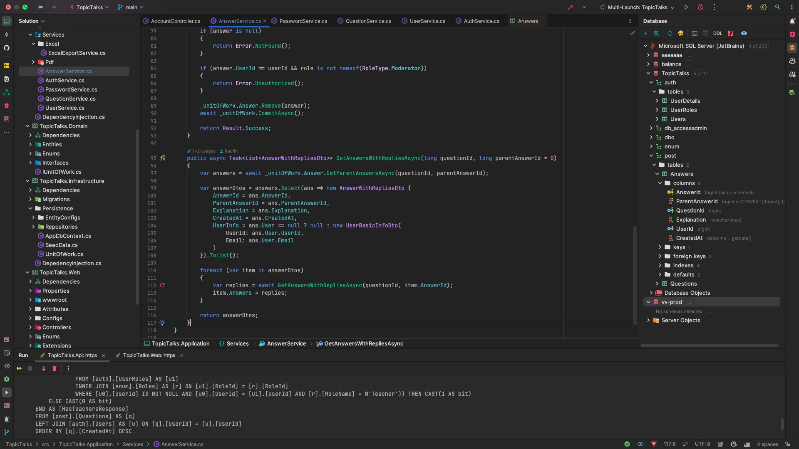

<p align= "center">
    
    <br/>
    <b>TopicTalks</b> is an educational discussion platform where students can ask questions and receive answers from teachers or fellow students. It features dynamic answers with recursive reply functionalities, PDF and Excel export options, moderator controls, role-based authorization, and much more 🤓
</p>

## 🔴 Live Demo

- **Web:** https://projects.rawfin.net/TopicTalks 
- **Api:** https://projects.rawfin.net/TopicTalks/api


## 📚 Table of Contents

- ⭐ [Give It a Star](#-give-it-a-star)
- 🚀 [Getting Started](#-getting-started)
  - I. 📝 [Requirements](#i-requirements-)
  - II. ⚙️ [Installation](#ii-installation-%EF%B8%8F)
      - [Clone the Repository](#1-clone-the-repository)
      - [Build the Projects](#2-build-the-projects-api-and-web)
      - [Database Migration](#3-database-migration)
      - [Run the Projects](#4-run-the-projects-seperately)
  - III. 🌐 [Access the Projects](#iii-access-the-projects-)
- 🛠️ [Technologies and Design Patterns](#%EF%B8%8F-technologies-and-design-patterns)
- 📦 [Nuget Packages](#-nuget-packages)
- 📊 [ER Diagram](#-er-diagram)
- 📸 [Screenshots](#-screenshots)
- 🪪 [License](#-license)


## ⭐ Give It a Star

If you find this project useful or interesting, please consider giving it a star. Thank you! 🤗

[](https://github.com/Raofin/TopicTalks/stargazers)


## 🚀 Getting Started

### I. Requirements 📝

* .NET 8 SDK
* Microsoft SQL Server
* JetBrains Rider, Visual Studio 2022, or VS Code

### II. Installation ⚙️

#### 1. Clone the Repository
  ```powershell
  gh repo clone Raofin/TopicTalks
  ```

#### 2. Build the Projects (API and Web)
  ```powershell
  cd TopicTalks/src
  dotnet build TopicTalks.Api/TopicTalks.Api.csproj
  dotnet build TopicTalks.Web/TopicTalks.Web.csproj

  ```

#### 3. Database Migration
  The project is configured to automatically apply migrations to the [default localhost server](src/TopicTalks.Api/appsettings.json#L13) on the **first run**. However, you can also apply migrations manually using the following commands:
  * For Package Manager Console 👇
      ```powershell
      Update-Database -Context AppDbContext -Project TopicTalks.Infrastructure -StartupProject TopicTalks.Api
      ```
  * For CLI 👇
      ```powershell
      dotnet ef database update --project TopicTalks.Infrastructure/TopicTalks.Infrastructure.csproj --startup-project TopicTalks.Api/TopicTalks.Api.csproj
      ```
#### 4. Run the Projects (Seperately)
  ```powershell
  dotnet run --project TopicTalks.Api/TopicTalks.Api.csproj --urls "https://localhost:5001"
  ```
  ```powershell
  dotnet run --project TopicTalks.Web/TopicTalks.Web.csproj --urls "https://localhost:5002"
  ```


### III. Access the Projects 🌐
* API: https://localhost:5001/swagger
* Web: https://localhost:5002


## 🛠️ Technologies and Design Patterns

### Language 🔠
  * C#
### Frameworks 🔧
  * ASP.NET Core Web API 8
  * ASP.NET Core MVC 8
  * Entity Framework Core 8
### Database 🛢
  * Microsoft SQL Server
### Frontend Library 📑
  * jQuery
  * jQuery Validate
  * Bootstrap 5
  * BoxIcons
### Architectural and Design Patterns 📐
  * Clean Architecture 🦾
  * Code First Approach with Fluent API
  * Repository Pattern
  * Unit of Work (UoW)
  * Result Pattern


## 📦 Nuget Packages 

| Package Name     | Used to 👇                                                                                                                    |
| ---------------- | ----------------------------------------------------------------------------------------------------------------------------- |
| [Swashbuckle](https://www.nuget.org/packages/Swashbuckle.AspNetCore/) | Generate API documentation from Web API controllers                      |
| [ErrorOr](https://www.nuget.org/packages/ErrorOr) | Handle errors and return results efficiently                                                 |
| [FluentValidation](https://www.nuget.org/packages/FluentValidation.AspNetCore) | Apply server-side data validation rules                         |
| [DinkToPdf](https://www.nuget.org/packages/DinkToPdf) | Generate beautiful PDFs from HTML                                                        |
| [ClosedXML](https://www.nuget.org/packages/ClosedXML) | Generate Excel (.xlsx) files                                                             |
| [WebOptimizer](https://www.nuget.org/packages/LigerShark.WebOptimizer.Core) | Bundle and minify CSS & JavaScript files for faster loading        |
| [WebMarkupMin](https://www.nuget.org/packages/WebMarkupMin.AspNetCore8) | Minify MVC HTML content to reduce file size for improved performance   |

## 📊 ER Diagram


## 📸 Screenshots

View at 👉 [be.net/TopicTalks](https://www.be.net/gallery/195808869/TopicTalks)

<p align= "center">
    
    
    
    
    
    
    
    
    
    
<p/>


## 🪪 License

Distributed under the BSD 3-Clause License. See [LICENSE](LICENSE) for more information.