<p align= "center">
    
    <br/>
    <b>TopicTalks</b> is an educational discussion platform where students can ask questions and receive answers from teachers or fellow students. It features dynamic answers with recursive reply functionalities, email notifications, PDF and Excel export options, role-based authorization, a highly interactive frontend with <b>pixel-perfect</b> UI/UX design, and much more 🤓
</p>

## 🔴 Live Demo

- **Web:** https://projects.rawfin.net/TopicTalks 
- **Api:** https://projects.rawfin.net/TopicTalks/api


## 📚 Table of Contents

- 🚀 [Getting Started](#-getting-started)
  - I. 📝 [Requirements](#i-requirements-)
  - II. ⚙️ [Installation](#ii-installation-%EF%B8%8F)
      - [Clone the Repository](#1-clone-the-repository)
      - [Setup Google Cloud API Credentials (Optional) ☁️](#2-setup-google-cloud-api-credentials-optional-%EF%B8%8F)
      - [Database Migration](#3-database-migration)
      - [Build the Projects](#4-build-the-projects)
      - [Run the Projects](#5-run-the-projects-seperately)
      - [Access the Projects](#6-access-the-projects-) 🌐
- 🛠️ [Technologies and Design Patterns](#%EF%B8%8F-technologies-and-design-patterns)
- 📦 [Nuget Packages](#-nuget-packages)
- 📊 [ER Diagram](#-er-diagram)
- 📸 [Screenshots](#-screenshots)
- 🪪 [License](#-license)


## ⭐ Give It a Star

If you find this project useful or interesting, please consider giving it a star. Thank you! 🤗

[](https://github.com/Raofin/TopicTalks/stargazers)


## 🚀 Getting Started

### I. Requirements 📝

* [.NET 8 SDK](https://dotnet.microsoft.com/en-us/download/dotnet/8.0) (or higher)
* [Microsoft SQL Server](https://www.microsoft.com/en-us/sql-server/sql-server-downloads#:~:text=Download%20now-,Express,-SQL%20Server%202022)
* [JetBrains Rider](https://www.jetbrains.com/community/education/#students) (edu), [Visual Studio](https://visualstudio.microsoft.com/vs/community), or [VS Code](https://code.visualstudio.com)

### II. Installation ⚙️

#### 1. Clone the Repository
  ```powershell
  gh repo clone Raofin/TopicTalks
  ```

#### 2. Setup Google Cloud API Credentials (Optional) ☁️

<details><summary>
✅ Free forever.<br>

After researching free cloud storage options, Google Drive storage through Google Cloud seemed to be the best fit for this project. Given the limited resources available on the internet for interacting with the Google Drive APIs, it took me a while to understand and [implement the functionalities](src/TopicTalks.Infrastructure/Services/Cloud/GoogleCloud.cs). 

However, in order for the project to run with full functionality, you'll need to have your own Google Drive API credentials inserted in the [GoogleCredentials.json](src/TopicTalks.Api/GoogleCredentials.json). <b>Here are the steps to follow to create a free Google Cloud project and get the credentials 🔽</b></summary>

1. Create a project in the [Google Cloud Console](https://console.cloud.google.com/projectcreate)
2. Enable [Google Drive API](https://console.cloud.google.com/apis/library/drive.googleapis.com) for the project<br>
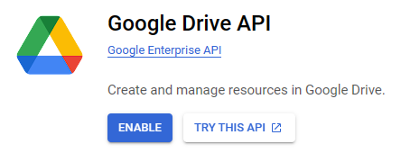<br>
3. Select `Create Credentials`<br>
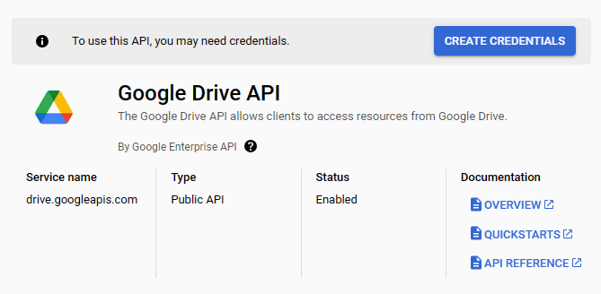<br>
4. Select `Application Data` -> Click `Next`<br>
<br>
5. Fill out the details -> Select `Owner` in Role -> Click `Done`<br>
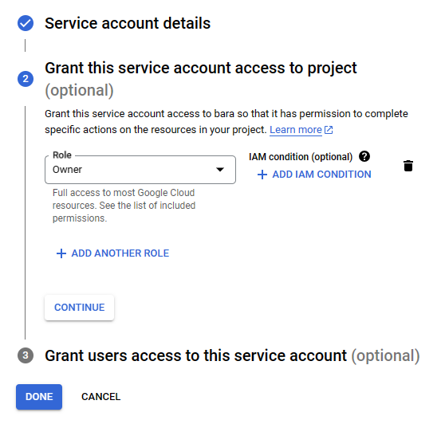<br>
6. Go to [Service Accounts](https://console.cloud.google.com/iam-admin/serviceaccounts) -> Select the newly created service account
7. Select `Keys` -> Click `Add Key` -> Choose JSON -> Click `Create`<br>(The credentials `json` file should be automatically downloaded)<br>
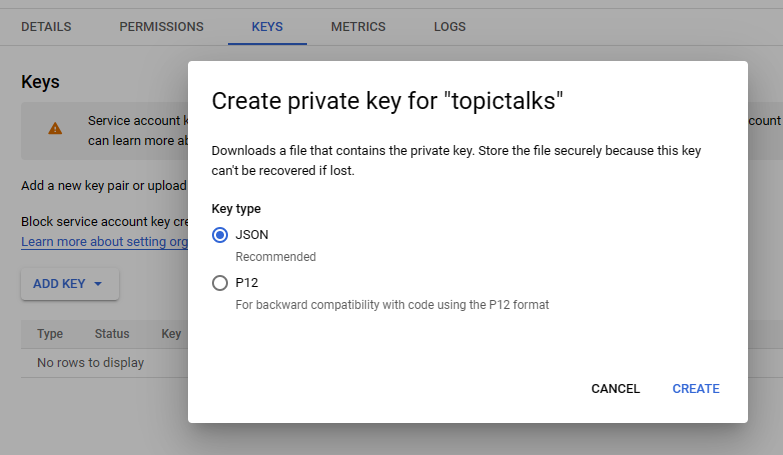<br>
8. Open the file and copy the value of `client_email`
9. Go to [Google Drive](https://drive.google.com/drive) -> Create a folder named `TopicTalks`
10. Share the folder with the `client_email`<br>
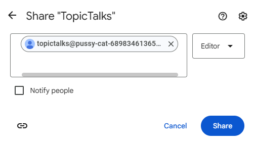<br>
11. Finally, paste everything from the downloaded `json` file into [GoogleCredentials.json](src/TopicTalks.Api/GoogleCredentials.json)
12. [Star this project](https://github.com/Raofin/TopicTalks)
</details>

#### 3. Database Migration
  The project is configured to automatically apply migrations to the [default localhost server](src/TopicTalks.Api/appsettings.Development.json#L4) on the **first run**. However, you can also apply migrations manually using the following commands:
  * For Package Manager 👇
      ```powershell
      Update-Database -Context AppDbContext -Project TopicTalks.Infrastructure -StartupProject TopicTalks.Api
      ```
  * For CLI 👇
      ```powershell
      dotnet ef database update --project TopicTalks.Infrastructure/TopicTalks.Infrastructure.csproj --startup-project TopicTalks.Api/TopicTalks.Api.csproj
      ```

<details>
  <summary><b>🌻 Useful Commands</b></summary>
    
```powershell
Add-Migration Init -Context AppDbContext -Project TopicTalks.Infrastructure -StartupProject TopicTalks.Api
```
```powershell
Remove-Migration -Project TopicTalks.Infrastructure -StartupProject TopicTalks.Api -Force
```
```powershell
Update-Database -Context AppDbContext -Project TopicTalks.Infrastructure -StartupProject TopicTalks.Api
```
```powershell
Update-Database -Migration Init -Context AppDbContext -Project TopicTalks.Infrastructure -StartupProject TopicTalks.Api
```
</details>  

#### 4. Configure Email Settings via User Secrets 📬
To use Gmail's smtp server, you will need to use an [app password](https://myaccount.google.com/apppasswords). Note that this requires having [2-step verification](https://myaccount.google.com/signinoptions/two-step-verification/enroll-welcome) enabled in your account.

Use the following Commands to store the crediantials in user secrets 👇

```powershell
dotnet user-secrets --project src/TopicTalks.Api set EmailSettings:Email you@gmail.com
dotnet user-secrets --project src/TopicTalks.Api set EmailSettings:Password your-password
```

> If you are using a different server, set the [server and port](src/TopicTalks.Api/appsettings.json#L11-L17) as well accordingly.


#### 4. Build the Projects
  ```powershell
  cd TopicTalks/src
  dotnet build TopicTalks.Api/TopicTalks.Api.csproj
  dotnet build TopicTalks.Web/TopicTalks.Web.csproj

  ```

#### 5. Run the Projects (Seperately)
  ```powershell
  dotnet run --project TopicTalks.Api/TopicTalks.Api.csproj --urls "https://localhost:9998"
  ```
  ```powershell
  dotnet run --project TopicTalks.Web/TopicTalks.Web.csproj --urls "https://localhost:9999"
  ```

<p align= "center">
  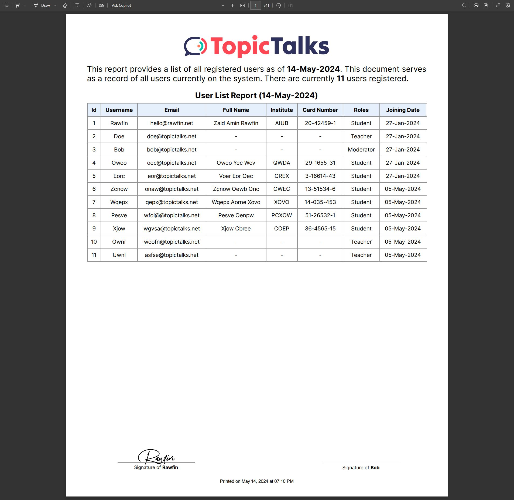
  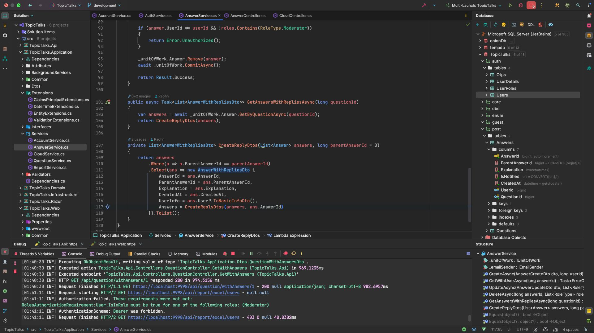
</p>

#### 6. Access the Projects 🌐
* API: https://localhost:9998
* Web: https://localhost:9999


## 🛠️ Technologies and Design Patterns

### Frameworks 🔧
  * ASP.NET Core 8.0 Web API
  * ASP.NET Core 8.0 MVC
  * Entity Framework Core 8.0
### Database 🛢
  * Microsoft SQL Server
### Frontend Library 📑
  * jQuery
  * jQuery Validate
  * Bootstrap 5
  * Popper.js
  * Tippy.js
  * FontFace Observer
### Architectural and Design Patterns 📐
  * Clean Architecture 🦾
  * Result Pattern
  * Database Code First Approach with Fluent API
  * Repository Pattern
  * Unit of Work (UoW)


## 📦 Nuget Packages 

| Package Name     | Used to 👇                                                                                                                    |
| ---------------- | ----------------------------------------------------------------------------------------------------------------------------- |
| [Swashbuckle](https://www.nuget.org/packages/Swashbuckle.AspNetCore/) | Generate API documentation from Web API controllers                      |
| [ErrorOr](https://www.nuget.org/packages/ErrorOr) | Handle errors and return results efficiently                                                 |
| [Serilog](https://www.nuget.org/packages/Serilog) |  Log events in a very structured way                                                         |
| [FluentValidation](https://www.nuget.org/packages/FluentValidation.AspNetCore) | Apply server-side data validation rules                         |
| [FluentEmail](https://www.nuget.org/packages/FluentEmail.Smtp) |  Send emails using SMTP servers                                                 |
| [Google Apis](https://www.nuget.org/packages/Google.Apis.Drive.v3) | 	Interact with cloud storage                                                |
| [DinkToPdf](https://www.nuget.org/packages/DinkToPdf) | Generate beautiful PDFs from HTML                                                        |
| [ClosedXML](https://www.nuget.org/packages/ClosedXML) | Generate Excel (.xlsx) files                                                             |
| [WebOptimizer](https://www.nuget.org/packages/LigerShark.WebOptimizer.Core) | Bundle and minify CSS & JavaScript files for faster loading        |
| [WebMarkupMin](https://www.nuget.org/packages/WebMarkupMin.AspNetCore8) | Minify MVC HTML content to reduce file size for improved performance   |

## 📊 ER Diagram

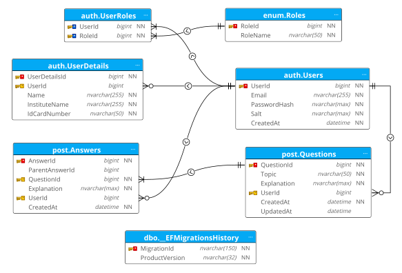


## 📸 Screenshots

View at 👉 [be.net/TopicTalks](https://www.be.net/gallery/195808869/TopicTalks)

<p align= "center">
    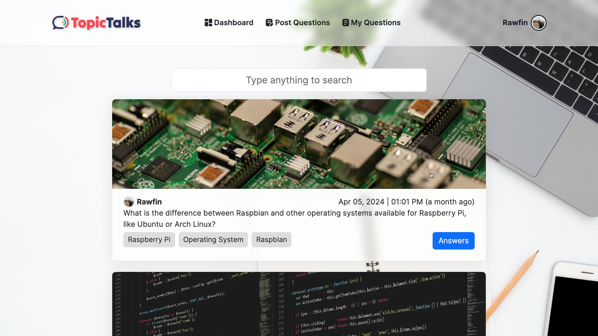
    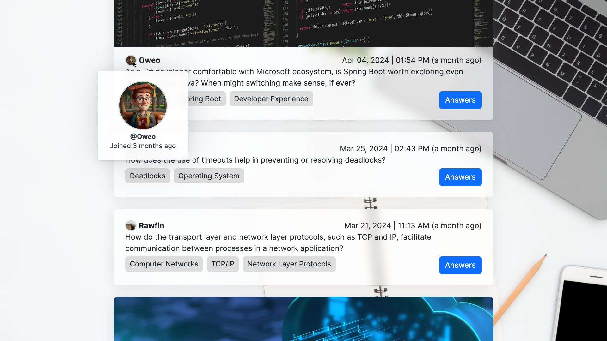
    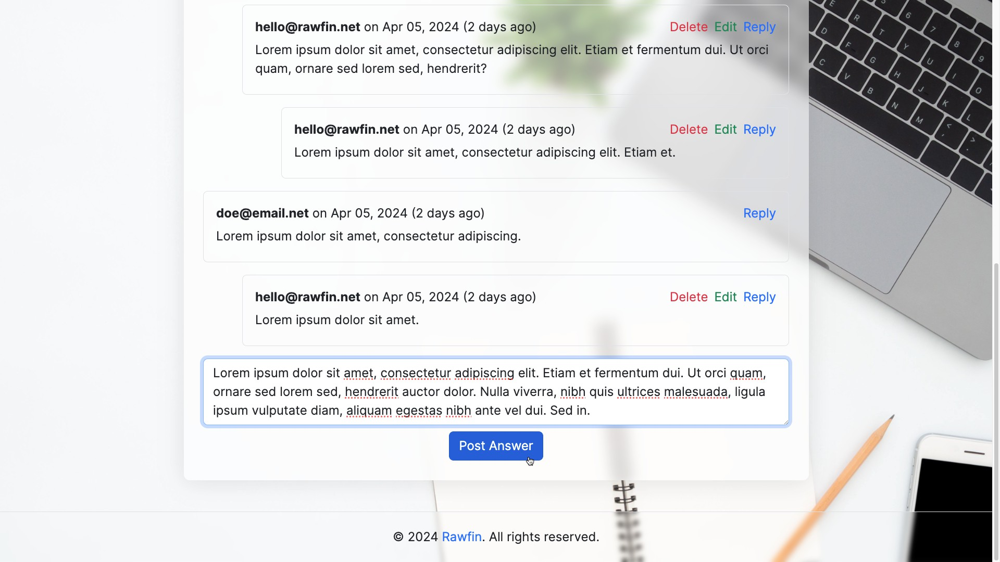
    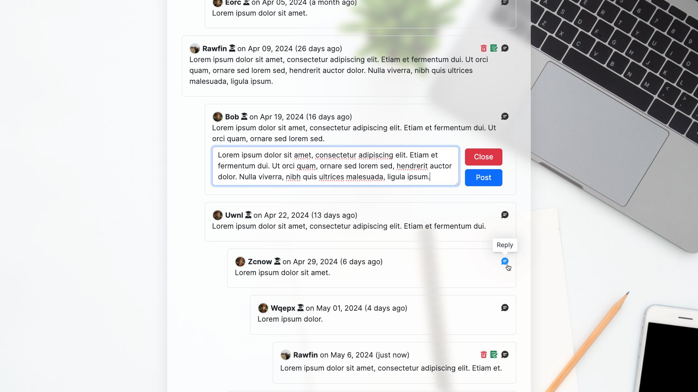
    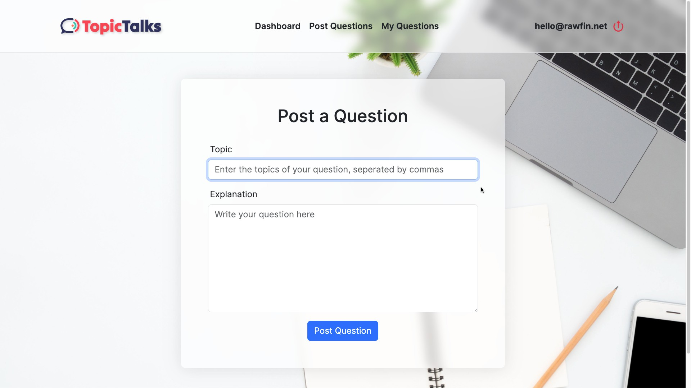
    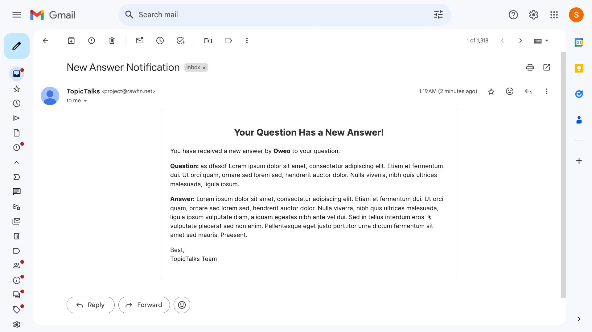
    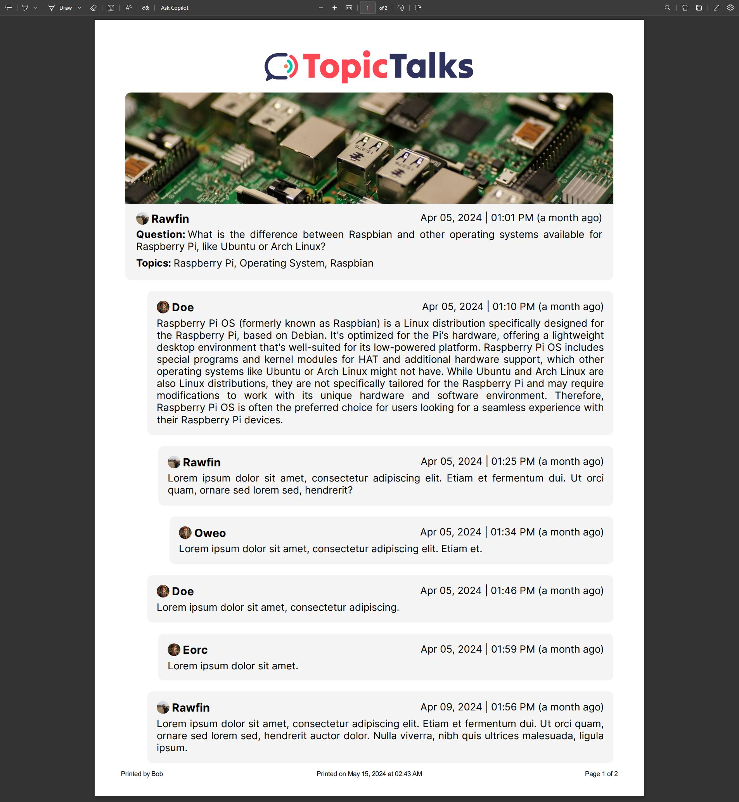
    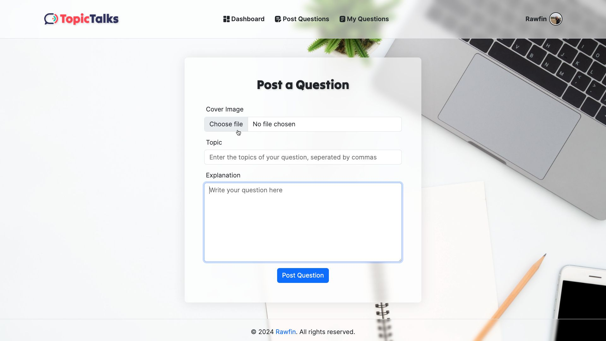
    
    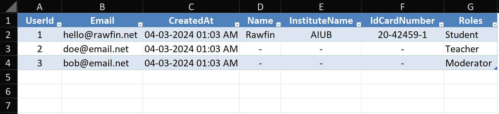
    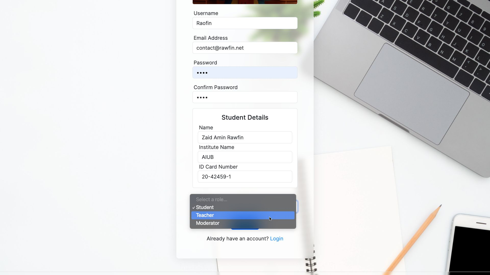
    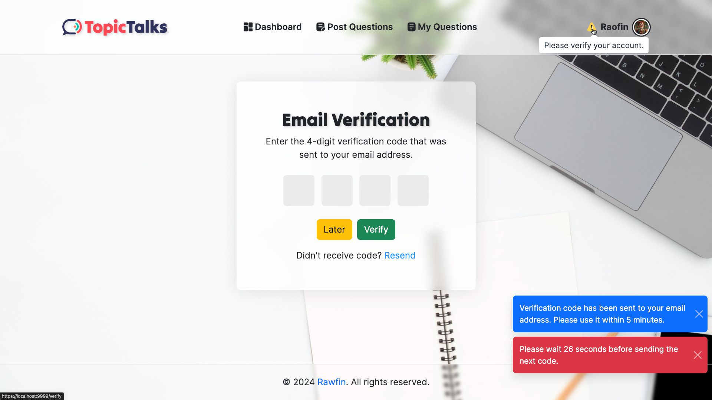
    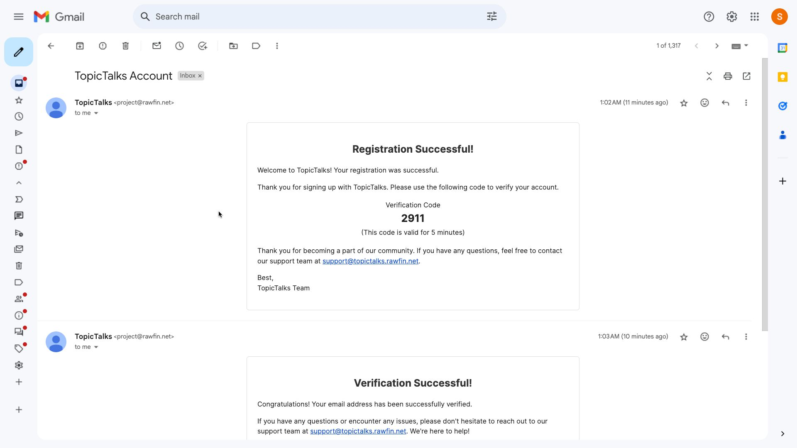
    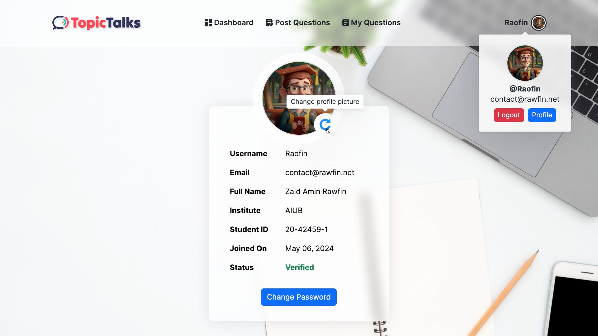
    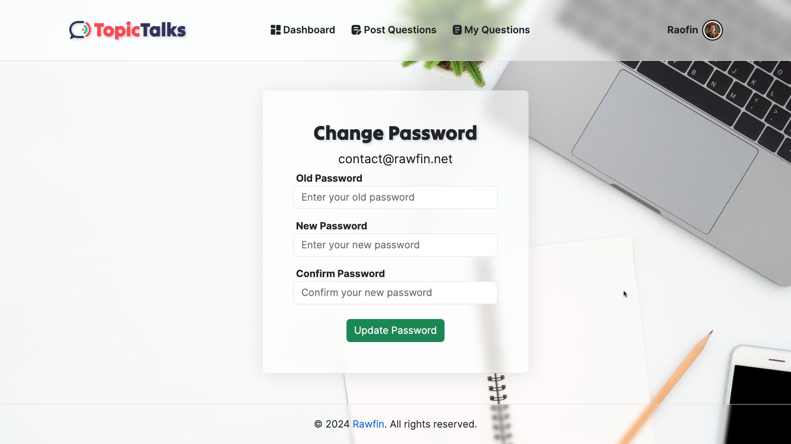
    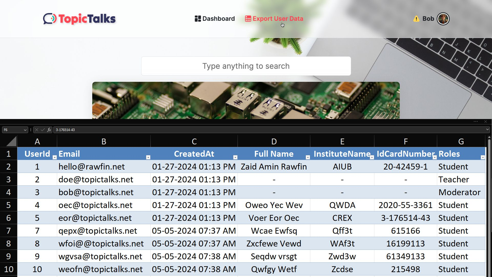
<p/>

## 🪪 License

Distributed under the BSD 3-Clause License. See [LICENSE](LICENSE) for more information.